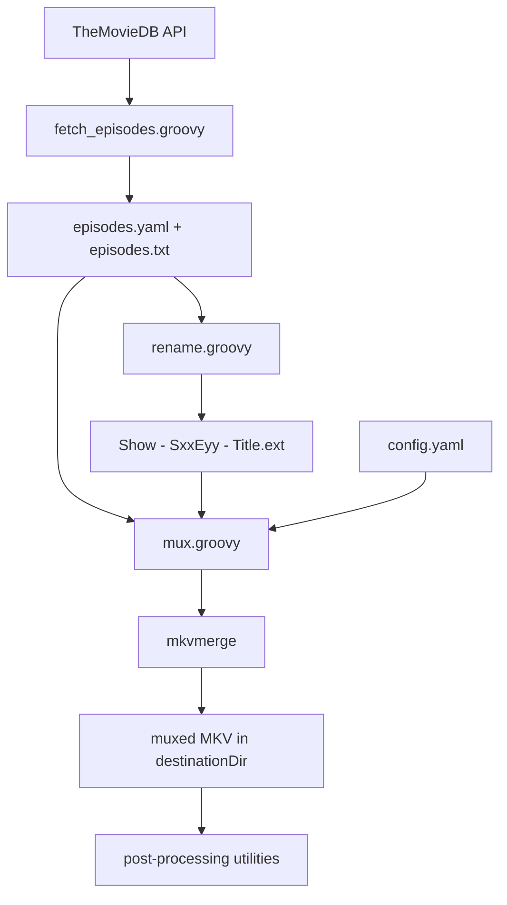

# MKV Scripts

[](https://github.com/vdenisov/mkv-scripts/actions/workflows/ci.yml)
[](LICENSE)
[](https://groovy-lang.org/)

A small toolkit of Groovy scripts for remuxing TV shows and movies with
[MKVToolNix](https://mkvtoolnix.download/). It grew out of the repetitive grind of
processing episodes with a large number of tracks: picking the right audio and
subtitle tracks, setting languages, titles and default flags, merging external
dubs and subtitles, and naming everything consistently.

It is deliberately narrow in scope — each script does one thing, operates on the
current directory, and is small enough to read and adapt in a few minutes.

```
mkv-mux --identify        # what tracks does this file have?
mkv-mux --check           # are all the episodes structured the same?
mkv-mux --dry-run         # what would be muxed, exactly?
mkv-mux                   # do it
```

## Prerequisites

- **Java 11+** and **Groovy 3 or newer** — CI runs the test suite on both the
  minimum (Groovy 3 / JDK 11) and a current setup (Groovy 5 / JDK 21), and a
  weekly run additionally tests against the newest MKVToolNix release.
- **MKVToolNix** — `mkvmerge` is auto-detected from `PATH` (with a fallback to the
  default Windows install location); you can also set an explicit path in
  `config.yaml`. `mkvpropedit` (on `PATH`) is needed only for
  `filename_to_title.groovy` and `propedit.groovy`.
- Network access on first run — dependencies are declared via `@Grab` and
  downloaded automatically.
- A [TheMovieDB](https://www.themoviedb.org/) API key — only for
  `fetch_episodes.groovy`.

## Pipeline overview

The scripts form a loose pipeline. Only `mux.groovy` is essential; everything
else is optional tooling around it.



## Command wrappers

`bin/` contains a thin wrapper per script — a `.bat` for Windows and an
extension-less shell script for Linux/macOS — so you can run everything from
whatever directory your media files are in, without copying the scripts around.

Add `bin/` to your `PATH` once:

```powershell
# Windows (persists for the current user)
setx PATH "%PATH%;C:\path\to\mkv-scripts\bin"
```

```bash
# Linux / macOS (add to your shell profile)
export PATH="$PATH:/path/to/mkv-scripts/bin"
```

Then, from any directory:

```
mkv-mux                              # instead of: groovy .../src/mux.groovy
mkv-rename "Show Name"
mkv-propedit --edit track:a2 --set flag-forced=0
```

| Command | Script |
|---------|--------|
| `mkv-mux` | `mux.groovy` |
| `mkv-fetch-episodes` | `fetch_episodes.groovy` |
| `mkv-rename` | `rename.groovy` |
| `mkv-filename-to-title` | `filename_to_title.groovy` |
| `mkv-propedit` | `propedit.groovy` |
| `mkv-to-utf8` | `to_utf8.groovy` |
| `mkv-fix-srt` | `fix_srt.groovy` |
| `mkv-find-unused-fonts` | `find_unused_fonts.groovy` |

Each wrapper locates its script relative to its own location, so `bin/` can live
anywhere — but add the directory to `PATH` rather than symlinking individual
wrappers elsewhere, as the shell wrappers do not resolve symlinks.

## Scripts

All scripts operate on the current working directory — run them from the
directory containing your media files (via the `bin/` wrappers above, or
`groovy <path-to-repo>/src/<script>.groovy`). `mux.groovy` reads `config.yaml`
from the current directory — a per-show config dropped next to the media files —
or from an explicit `--config <path>`. The repo ships `src/config.example.yaml`
as a template to copy and edit; it is never loaded automatically. Only the test
suite is run from the repo root:

| Script | Purpose |
|--------|---------|
| `mux.groovy` | The core muxer: builds and runs an `mkvmerge` command for every media file in the current directory, driven by `config.yaml`. `--identify` lists tracks, `--check` compares track structure across the batch, `--dry-run` prints commands without running them, and file names or globs (plus `--exclude`) narrow the batch. |
| `fetch_episodes.groovy` | Fetches episode names for a show/season from TheMovieDB and writes `episodes.txt`. |
| `rename.groovy` | Batch-renames files to `Show - SxxEyy - Title.ext` using `episodes.txt`. |
| `filename_to_title.groovy` | Sets the MKV segment title and video track name to the file name (via `mkvpropedit`). |
| `propedit.groovy` | Batch-runs `mkvpropedit` over every MKV in the current directory, passing your arguments through — fix any property (track names, forced/default flags, …) without a full remux. |
| `to_utf8.groovy` | Converts `.srt`/`.ass`/`.ssa`/`.vtt` subtitles to UTF-8 in place, from `--encoding` (default Windows-1251). Skips files that are already UTF-8; `--backup` keeps the originals. |
| `fix_srt.groovy` | Converts subtitles in a non-standard timing format into valid SRT (writes `<name>.srt.fixed`). A malformed file is reported and skipped rather than stopping the batch. |
| `find_unused_fonts.groovy` | Lists font files in `fonts/` that are not referenced by any `.ass` subtitle in the current directory. |

### fetch_episodes.groovy

```
groovy src/fetch_episodes.groovy --show-id 2260 --season 1 [--api-key KEY]
groovy src/fetch_episodes.groovy --show-id https://www.themoviedb.org/tv/1920-twin-peaks/season/1
groovy src/fetch_episodes.groovy --show-id 1920 --season 1 --language ru-RU
```

`--show-id` takes either the numeric id or the show's URL, so the address can be
pasted straight from a browser. A URL that names a season supplies `--season`
too; passing a `--season` that disagrees with the URL is an error rather than a
silent choice between the two.

If `--api-key` is not supplied, the key is read from `apikey.txt` — the current
directory first, then the copy next to the script, so the key does not have to be
copied into every media directory. Endpoint examples live in `src/themoviedb.http`.

`--language` takes a TheMovieDB locale such as `ru-RU`, and the names are fetched
in that language. TheMovieDB answers an untranslated field with an empty string
rather than falling back on its own, so a partially translated season is topped
up from `en-US` and the script says when it did that.

Two files are written, both UTF-8, so non-Latin titles survive:

- **`episodes.yaml`** — the full metadata: show name, year, season number and
  name, and every episode by its real episode number. `mux.groovy` and
  `rename.groovy` both prefer it.
- **`episodes.txt`** — one episode name per line, the format that can be written
  by hand when there is no reason to involve the API at all.

Names are written **exactly as TheMovieDB spells them**, including the `:` and
`?` that cannot appear in a Windows file name. Stripping those is `rename.groovy`'s
job, at the moment a name becomes a file name — `mux.groovy` needs the original
spelling for titles, and a name stripped here could never be recovered.

Failures are reported rather than thrown: a bad key, an unknown show or a
nonexistent season prints TheMovieDB's own message and exits non-zero.

### rename.groovy

```
groovy src/rename.groovy                          # show name from episodes.yaml
groovy src/rename.groovy "Show Name" [episodeOffset]
groovy src/rename.groovy "Show Name" --dry-run    # preview, rename nothing
```

Renames every media/subtitle file whose name contains an `sXXeYY` pattern to
`Show Name - SXXEYY - <episode title>.<ext>`. A trailing `[suffix]` in the
original name (e.g. a dub studio tag) is preserved.

Titles come from `episodes.yaml` when it is present, and from `episodes.txt`
otherwise. The yaml carries real episode numbers, so a season with a gap in its
numbering stays aligned. The show name is also taken from `episodes.yaml`, which
makes the positional argument optional — pass it to override. Names are
sanitized here, at the point they become file names.

`episodes.txt` has no numbers in it, so it is matched by line order, and
`episodeOffset` (default 1) is the episode number of its first line. That exists
for the case it was invented for: a season downloaded in halves, where you fetch
titles for episodes 11–20 and `11` makes the first line mean E11.

**`episodeOffset` applies to `episodes.txt` only.** With `episodes.yaml` the
episode numbers are already real, so nothing is shifted and the argument is
ignored — passing the offset you would have needed for a trimmed `episodes.txt`
would otherwise put episode 1's title on E11, which looks entirely plausible and
is wrong.

The whole batch is checked before anything is renamed. If any file has no
`sXXeYY` pattern, has no matching title, or would overwrite an existing file or
collide with another rename, every problem is listed and nothing is touched.
This matters because renaming removes the `sXXeYY` pattern that ties a file to
its episode, so a rename that failed halfway would have to be untangled by hand.

`--dry-run` prints the planned `old -> new` pairs and exits.

### mux.groovy

```
groovy src/mux.groovy                          # check, then mux every matching file
groovy src/mux.groovy --identify               # list tracks per file, mux nothing
groovy src/mux.groovy --check                  # compare tracks across files, mux nothing
groovy src/mux.groovy --dry-run                # print the mkvmerge command per file, run nothing
groovy src/mux.groovy "Show.S01E0[12].mkv"     # only the files matching a pattern
groovy src/mux.groovy --exclude "*.sample.mkv" # everything except the files matching a pattern
```

Reads `config.yaml` (see [Configuration](#configuration) below), discovers all
files in the current directory matching `allowedExtensions`, and runs `mkvmerge`
for each one. Output goes to `destinationDir`. If a file fails, the error is
printed and processing continues with the next file.

Titles in the config can be templates rather than fixed strings — see
[Substitution variables](#substitution-variables). `--identify` also lists the
tracks of any companion files the config declares, with the path each pattern
resolved to for that episode and a `(not found)` line where one is missing.

#### Selecting a subset of the files

Positional arguments narrow the batch to the files you name; `--exclude` drops
files from it. Both accept an exact file name or a glob, both may be repeated,
and both apply in every mode — including `--identify` and `--dry-run`. With no
arguments the behaviour is unchanged: every file in the directory.

```
groovy src/mux.groovy Show.S01E03.mkv                        # one file
groovy src/mux.groovy Show.S01E01.mkv Show.S01E03.mkv        # several files
groovy src/mux.groovy "Show.S01E*.mkv" --exclude "*.sample.mkv"
```

Quote your patterns so the behaviour is identical across shells (the script
expands globs itself). A pattern that exactly names an existing file is taken
literally, so a file called `Odd[1].mkv` selects only itself rather than being
read as a character class. A pattern that matches nothing is reported, so a typo
does not look like a successful run with no work to do.

#### Companion file pre-flight

When `additionalSources` uses the `${fileName}` placeholder, every companion is
checked for existence before anything is muxed. Episodes whose companions are
missing are named and skipped; the rest of the batch is muxed normally.

```
*** 2 file(s) will be skipped: companion files are missing
      ${fileName}[Studio].mka  (missing for 2 file(s))
        Show.S01E13.mkv, Show.S01E14.mkv
```

A dub or subtitle release covering only part of a season is routine. Without the
check that surfaces as an mkvmerge failure partway through a long batch; with it,
the gaps are visible before the first mux and the complete episodes still get
processed. Those episodes would have failed anyway, so nothing is lost by
skipping them — this never aborts the run. If every episode is blocked, the run
says so instead of printing a bare `Done`.

#### Consistency check

`config.yaml` selects tracks by **numeric ID**, which quietly assumes every
episode in the directory has the same track layout. When that breaks — a
translation added mid-season, an old one dropped, a different release group
ordering tracks differently — mkvmerge does not complain; it muxes whatever sits
at that ID, and you discover the wrong dub at playback time.

The consistency check compares track structure across the whole batch and reports
it before muxing. It runs automatically (skip it with `--no-check`), or on its own
with `--check`, which muxes nothing and needs no `config.yaml` — so you can inspect
a season's structure before writing one. `--check` and `--identify` can be combined;
they answer different questions and share one `mkvmerge` scan.

Files are first grouped by **track layout** — a shifted track order or a missing
track forms its own group — and the **values** at each ID (codec, language, name,
default/forced flags) are then compared within each group, one row per distinct
value:

```
*** Layout 1 (20 files): video, audio, subs
    ID   TYPE   CODEC                LANG  DEF  FOR  NAME
    0    video  AVC/H.264/MPEG-4p10  eng   yes  no   -
    1    audio  AC-3                 eng   yes  no   (no name)
    2    subs   SubRip/SRT           eng   yes  no   English (SDH)
           <- Show.S01E16 - Episode Sixteen.mkv
    2    subs   SubRip/SRT           eng   no   no   English (SDH)

*** Layout 2 (2 files): subs, video, audio
              Show.S01E18 - Episode Eighteen.mkv
           <- Show.S01E20 - Episode Twenty.mkv
    ID   TYPE   CODEC                LANG  DEF  FOR  NAME
    0    subs   SubRip/SRT           eng   yes  no   (no name)
    1    video  AVC/H.264/MPEG-4p10  eng   yes  no   -
    2    audio  AC-3                 eng   yes  no   English (SDH)

*** 1 discrepancy affects a track that config.yaml selects:
      2 files use a different track layout, at selected tracks 0, 1, 2
*** 1 informational (does not affect what gets muxed):
      track 2 (subtitles, config title "Signs") - default differs across 2 groups
```

- One row per distinct value, not per file — a 200-episode batch is as compact
  as a 3-episode one, and the differing cell is highlighted on a terminal.
- The `<-` lists name only the deviating files; the majority is the unnamed
  reference.
- With a `config.yaml` present, each difference is classified as **blocking**
  (it lands on a track the config selects) or informational.
- By default the check warns and continues; `--strict` aborts with exit 2 on any
  blocking discrepancy, and `--check-verbose` prints untruncated file lists.

The full reading guide — what is compared and ignored, the exact
blocking-vs-informational rules, colours — is in the
[reference](docs/reference.md#reading-the-consistency-check-report).

`--identify` prints the track table you need in order to write the config — id,
type, codec, language, default/forced flags and track name for every track of
every matching file:

```
*** Show.S01E01.mkv
  ID   TYPE       CODEC                  LANG  DEF  FOR  NAME
  0    video      AVC/H.264/MPEG-4p10    und   no   no   Video
  1    audio      AAC                    jpn   yes  no   Audio A
  2    audio      AAC                    eng   no   no   Audio B
  4    subtitles  SubRip/SRT             eng   yes  no   Subtitle A
```

`--dry-run` prints the exact command that would be run, which is the quickest
way to check track selection and `${fileName}` companion resolution before
committing to a long mux. Both flags leave the filesystem untouched — not even
`destinationDir` is created.

The printed command is meant for reading, not for pasting: mkvmerge's `(` and
`)` source-grouping tokens are not shell-safe as written.

### propedit.groovy

```
groovy src/propedit.groovy --edit track:a2 --set flag-forced=0
```

Runs `mkvpropedit` against every `.mkv` in the current directory, passing all
arguments through verbatim with the file name inserted first. Anything
`mkvpropedit` accepts works without editing the script:

```
groovy src/propedit.groovy --edit track:s1 --set flag-default=1
groovy src/propedit.groovy --edit info --set title="My Show"
groovy src/propedit.groovy --add-track-statistics-tags
```

Run with no arguments to print usage; nothing is modified. `-h`/`--help` is
handled locally only when it is the sole argument — in any other combination it
is passed through to `mkvpropedit`. Unlike `mux.groovy`, this script exits
non-zero if any file failed, so it can be used from a shell script.

### Post-processing utilities

```
groovy src/filename_to_title.groovy   # segment title + video track name := file name
groovy src/propedit.groovy            # batch mkvpropedit — fix properties without remuxing
groovy src/to_utf8.groovy             # subtitles → UTF-8, in place
groovy src/fix_srt.groovy             # repair non-standard SRT timing/markup
groovy src/find_unused_fonts.groovy   # report unreferenced fonts in fonts/
```

#### to_utf8.groovy

```
groovy src/to_utf8.groovy                          # from windows-1251 (the default)
groovy src/to_utf8.groovy --encoding windows-1250  # from something else
groovy src/to_utf8.groovy --backup                 # keep <name>.orig
groovy src/to_utf8.groovy --dry-run                # report, write nothing
```

Converts `.srt`, `.ass`, `.ssa` and `.vtt` files in the current directory to
UTF-8, **in place**. The source encoding defaults to `windows-1251` and is always
printed, so it is never a silent assumption. The target is always UTF-8 — making
that configurable would defeat the script's purpose.

Pass `--backup` to keep the original as `<name>.orig`, or `--dry-run` to preview.

It is safe to point at a directory more than once: already-UTF-8 files are
skipped, decoding is strict (a wrong `--encoding` is refused rather than quietly
producing mojibake), UTF-16 input is left alone, `.sub` files are deliberately
excluded, and line endings survive conversion. The full rationale is in the
[reference](docs/reference.md#to_utf8groovy-safety).

## Configuration

`mux.groovy` is driven by a YAML configuration file — `config.yaml` in the media
directory, or `--config <path>`. Quick start:

1. Copy `src/config.example.yaml` next to your media files as `config.yaml`.
2. Run `mkv-mux --identify` to see each file's track IDs.
3. Keep the tracks you want, delete the rest:

```yaml
general:
  destinationDir: "mkv"           # output goes here
  allowedExtensions: ["mkv"]

mainSource:
  videoTrack:
    language: "ja"                # title defaults to the file name
  audioTracks:
    - id: 1                       # ID from mkv-mux --identify
      language: "ja"
      title: "Japanese"
      default: true
  subtitleTracks:
    - id: 4
      language: "en"
      title: "English"
      default: true
```

Omitting `audioTracks` or `subtitleTracks` copies no tracks of that type, and
the output track order is derived from the config unless you set `trackOrder`
explicitly. Every field — including `additionalSources` for merging external
dubs and subtitles with per-episode `${fileName}` resolution — is covered in
the [configuration reference](docs/reference.md#configuration).

## Substitution variables

Titles and companion paths in `config.yaml` are templates. Instead of writing
one static string per season, write what the value is made of:

```yaml
general:
  title: "${showName} - S${seasonNum}E${episodeNum} - ${episodeName}"

mainSource:
  videoTrack:
    title: "Original Japanese"        # the video track's own name
  audioTracks:
    - id: 1
      language: "ru"
      title: "${languageNative} ${codec}"      # "Русский DTS"
  subtitleTracks:
    - id: 4
      language: "en"
      title: "${languageName} ${codec}"        # "English SRT"
```

**File-scope variables** describe the episode and are valid in every templated
field:

| Variable | Example | Comes from |
|---|---|---|
| `fileName` | `Show - S01E02 - Title` | the file being muxed |
| `extension` | `mkv` | the file being muxed |
| `showName` | `Twin Peaks` | `episodes.yaml`, else the canonical file name |
| `seasonNum` | `01` | the `SxxEyy` in the file name, else `episodes.yaml` |
| `episodeNum` | `02` | the `SxxEyy` in the file name |
| `episodeName` | `Traces to Nowhere` | `episodes.yaml` / `episodes.txt`, else the canonical file name |
| `seasonName` | `Season 1` | `episodes.yaml` |
| `showYear` | `1990` | `episodes.yaml` |

**Track-scope variables** describe one track and are valid only in a track's
`title`:

| Variable | Example | Comes from |
|---|---|---|
| `language` | `ru` | that track's `language` in the config |
| `languageName` | `Russian` | the JDK's language data |
| `languageNative` | `Русский` | the JDK's language data, capitalized |
| `codec` | `DTS`, `SRT`, `H.264` | the actual track, via `mkvmerge -J` |

Because `episodeName` comes from `episodes.yaml` rather than from the file name,
it keeps the characters a file name cannot hold — an episode really called
`Zen, or the Skill to Catch a Killer: Part 2?` is spelled that way in the title
even though the file on disk is not.

The segment (container) title and the video track name are separate fields.
`general.title` sets the first, `mainSource.videoTrack.title` the second; each
defaults to the file name independently. Players disagree about which of the two
they display, and some label one with the other's name — so if you are unsure
what yours reads, setting both to the same value is the safe option.

**A misspelled variable is an error, not a literal.** Every template is checked
before anything is probed or muxed, in every mode, and an unknown name — or a
track variable used in a file-scope field — exits 2 naming the offending field:

```
*** Error: config.yaml has 1 substitution problem:
  mainSource.audioTracks[0].title: ${languagName}
      valid here: codec, episodeName, episodeNum, extension, fileName, ...
```

A variable that is valid but has *no data for one particular episode* is a
different matter: those episodes are reported and dropped, and the rest of the
batch is muxed, the same way a missing companion file is handled. `--strict`
turns that into an abort as well.

There is no escape syntax, so a literal `${...}` cannot currently be written in
a title. `--check` prints templates unresolved, on purpose: its report runs
across the whole batch and identifies *which config entry* a finding refers to.

## Tests

Run the test suite from the repo root:

```
groovy src/test/run_tests.groovy
groovy src/test/run_tests.groovy --help
groovy src/test/run_tests.groovy --filter 01 --keep
groovy src/test/run_tests.groovy --mkvmerge-exe /usr/bin/mkvmerge
```

`mkvmerge` is auto-detected from PATH; use `--mkvmerge-exe` to override. Cases
that need `mkvpropedit`, or a bare `groovy` on `PATH` for the wrapper smoke
test, skip themselves with a printed note when those are unavailable.

## Under the hood

If you are curious about the details — the output and colour conventions, the
full guide to reading the consistency check report, `to_utf8.groovy`'s safety
rationale, and the complete `config.yaml` field reference — they live in
[docs/reference.md](docs/reference.md).

## License

[MIT](LICENSE)
