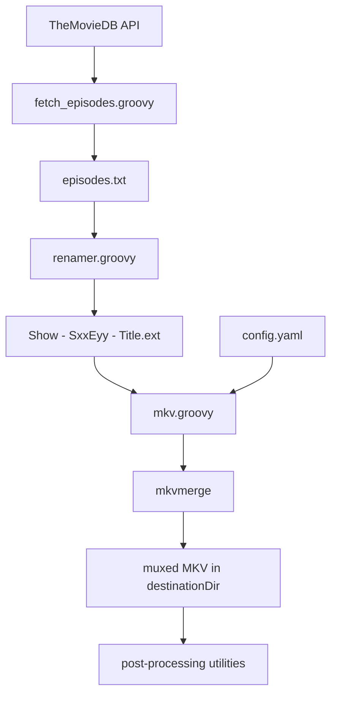

# MKV Scripts

[](https://github.com/vdenisov/mkv-scripts/actions/workflows/ci.yml)
[](LICENSE)
[](https://groovy-lang.org/)

A small toolkit of Groovy scripts for remuxing TV shows and movies with
[MKVToolNix](https://mkvtoolnix.download/). It grew out of the repetitive grind of
processing episodes with a large number of tracks: picking the right audio and
subtitle tracks, setting languages, titles and default flags, merging external
dubs and subtitles, and naming everything consistently.

It is deliberately narrow in scope — each script does one thing, operates on the
current directory, and is small enough to read and adapt in a few minutes.

## Prerequisites

- **Java 11+** and **Groovy 3 or newer** — CI runs the test suite on both the
  minimum (Groovy 3 / JDK 11) and a current setup (Groovy 5 / JDK 21), and a
  weekly run additionally tests against the newest MKVToolNix release.
- **MKVToolNix** — `mkvmerge` is auto-detected from `PATH` (with a fallback to the
  default Windows install location); you can also set an explicit path in
  `config.yaml`. `mkvpropedit` (on `PATH`) is needed only for
  `filename_to_title.groovy` and `prop.groovy`.
- Network access on first run — dependencies are declared via `@Grab` and
  downloaded automatically.
- A [TheMovieDB](https://www.themoviedb.org/) API key — only for
  `fetch_episodes.groovy`.

## Pipeline overview

The scripts form a loose pipeline. Only `mkv.groovy` is essential; everything
else is optional tooling around it.



## Scripts

All scripts operate on the current working directory — run them from the
directory containing your media files (for a repo checkout that means
`groovy <path-to-repo>/src/<script>.groovy`). `mkv.groovy` looks for
`config.yaml` in the current directory first — a per-show config dropped next
to the media files — and falls back to the `config.yaml` next to the script
(`src/config.yaml` in this repo). Only the test suite is run from the repo
root:

| Script | Purpose |
|--------|---------|
| `mkv.groovy` | The core muxer: builds and runs an `mkvmerge` command for every media file in the current directory, driven by `config.yaml`. |
| `fetch_episodes.groovy` | Fetches episode names for a show/season from TheMovieDB and writes `episodes.txt`. |
| `renamer.groovy` | Batch-renames files to `Show - SxxEyy - Title.ext` using `episodes.txt`. |
| `filename_to_title.groovy` | Sets the MKV segment title and video track name to the file name (via `mkvpropedit`). |
| `prop.groovy` | Batch-runs `mkvpropedit` over every MKV in the current directory — fix any property (track names, forced/default flags, …) without a full remux. Adjust the command line in the script to your needs; as committed, it clears the forced flag on the second audio track. |
| `to_utf8.groovy` | Converts `.srt` files from Windows-1251 to UTF-8 (writes `<name>.utf8.srt`). |
| `srtfixer.groovy` | Converts subtitles in a non-standard timing format into valid SRT (writes `<name>.srt.fixed`). |
| `find_unused_fonts.groovy` | Lists font files in `fonts/` that are not referenced by any `.ass` subtitle in the current directory. |

### fetch_episodes.groovy

```
groovy src/fetch_episodes.groovy --show-id 2260 --season 1 [--api-key KEY]
```

If `--api-key` is not supplied, the key is read from `apikey.txt` in the current
directory. Episode names are written to `episodes.txt`, one per line, with
characters invalid in Windows file names stripped. Endpoint examples live in
`src/themoviedb.http`.

### renamer.groovy

```
groovy src/renamer.groovy "Show Name" [episodeOffset]
```

Renames every media/subtitle file whose name contains an `sXXeYY` pattern to
`Show Name - SXXEYY - <episode title>.<ext>`, taking titles from `episodes.txt`.
A trailing `[suffix]` in the original name (e.g. a dub studio tag) is preserved.
`episodeOffset` (default 1) maps the first line of `episodes.txt` to an episode
number.

### mkv.groovy

```
groovy src/mkv.groovy
```

Reads `config.yaml` (current directory first, then the copy next to the
script), discovers all files in the current directory matching
`allowedExtensions`, and runs `mkvmerge` for each one. Output goes to
`destinationDir`. If a file fails, the error is printed and processing continues
with the next file. See [Configuration](#configuration) below.

To discover track IDs in a source file first:

```
mkvmerge -i episode.mkv
```

### Post-processing utilities

```
groovy src/filename_to_title.groovy   # segment title + video track name := file name
groovy src/prop.groovy                # batch mkvpropedit — fix properties without remuxing
groovy src/to_utf8.groovy             # Windows-1251 SRT → UTF-8
groovy src/srtfixer.groovy            # repair non-standard SRT timing/markup
groovy src/find_unused_fonts.groovy   # report unreferenced fonts in fonts/
```

## Configuration

`mkv.groovy` is driven by a YAML configuration file (`config.yaml`, located as
described above); the repo ships a working example at `src/config.yaml`.

### General settings

```yaml
general:
  destinationDir: "mkv"                                # Output directory
  allowedExtensions: ["mkv", "avi", "mp4"]            # File extensions to process
  # mkvmergeExe is optional: omit it to auto-detect mkvmerge from PATH,
  # or set it to a full path to override.
  mkvmergeExe: "C:\\Program Files\\MKVToolNix\\mkvmerge.exe"
```

### Main source settings

Defines tracks from the primary source file. Track IDs come from `mkvmerge -i`;
track 0 is always the video track.

```yaml
mainSource:
  videoTrack:
    language: "en"                                    # Video track language
    # title will be set to filename by default
    # title: "Custom Video Title"                     # Optional: override video track name

  audioTracks:
    - id: 2                                           # Track ID from mkvmerge -i
      language: "en"                                  # Track language
      title: "English"                                # Track title
      default: true                                   # Is default track (omit = false)
    - id: 1
      language: "ru"
      title: "Russian"
      default: false

  subtitleTracks:
    - id: 6
      language: "en"
      title: "English"
      charset: "UTF-8"                                # Optional: character set override
      default: true

  # additionalOptions:
  #   - "--compression"
  #   - "0:none"
```

- Omitting `audioTracks` entirely (or setting it to `[]`) copies no audio tracks.
- Omitting `subtitleTracks` entirely (or setting it to `[]`) copies no subtitle tracks.
- `charset` is optional; omit it to let mkvmerge use the subtitle file's detected encoding.
- `default` defaults to `false`/`no` when omitted.

### Track order

Controls the order of tracks in the output. Each entry is `sourceIndex:trackId`
where source 0 is the main source. **This string must be kept in sync with the
track IDs listed above** — a mismatch produces a mkvmerge error.

```yaml
trackOrder: "0:0,0:2,0:1,0:6"
```

### Additional sources

Include tracks from extra files (audio dubs, external subtitles). Each
additional source must contain exactly one track. Track ID is always 0.

`${fileName}` in the `file` field is replaced at runtime with the base name (no
extension) of the current main source file, enabling per-episode companion
files.

```yaml
additionalSources:
  - file: "${fileName}[Dub Studio].mka"               # ${fileName} = base name of main source
    tracks:
      - language: "en"
        title: "English"
        charset: "UTF-8"                              # Optional: charset for subtitle tracks
        default: false
    # additionalOptions:
    #   - "--compression"
    #   - "0:none"
```

### Example configurations

#### Basic configuration with English audio and subtitles

```yaml
mainSource:
  videoTrack:
    language: "en"
  audioTracks:
    - id: 1
      language: "en"
      title: "English"
      default: true
  subtitleTracks:
    - id: 2
      language: "en"
      title: "English"
      default: true
trackOrder: "0:0,0:1,0:2"
```

#### Configuration with multiple audio tracks

```yaml
mainSource:
  videoTrack:
    language: "en"
    title: "Custom Video Title"  # Override default title
  audioTracks:
    - id: 1
      language: "en"
      title: "English"
      default: true
    - id: 2
      language: "ja"
      title: "Japanese"
      default: false
    - id: 3
      language: "fr"
      title: "French"
      default: false
  additionalOptions:
    - "--compression"
    - "0:none"
trackOrder: "0:0,0:1,0:2,0:3"
```

#### Configuration with an external subtitle file

```yaml
mainSource:
  videoTrack:
    language: "en"
  audioTracks:
    - id: 1
      language: "en"
      title: "English"
      default: true
additionalSources:
  - file: "${fileName}.srt"
    tracks:
      - language: "en"
        title: "English"
        charset: "UTF-8"
        default: true
trackOrder: "0:0,0:1,1:0"
```

### Key assumptions

1. The first track in the main source will always contain a video track (track ID 0)
2. Each additional source contains exactly one track (audio or subtitle, never video)
3. Track ID 0 is assumed for all tracks in additional sources

## Tests

Run the test suite from the repo root:

```
groovy src/test/run_tests.groovy
groovy src/test/run_tests.groovy --help
groovy src/test/run_tests.groovy --filter 01 --keep
groovy src/test/run_tests.groovy --mkvmerge-exe /usr/bin/mkvmerge
```

`mkvmerge` is auto-detected from PATH; use `--mkvmerge-exe` to override.

## License

[MIT](LICENSE)
